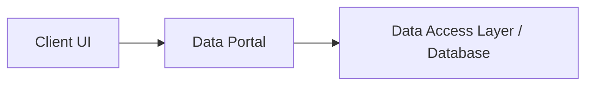
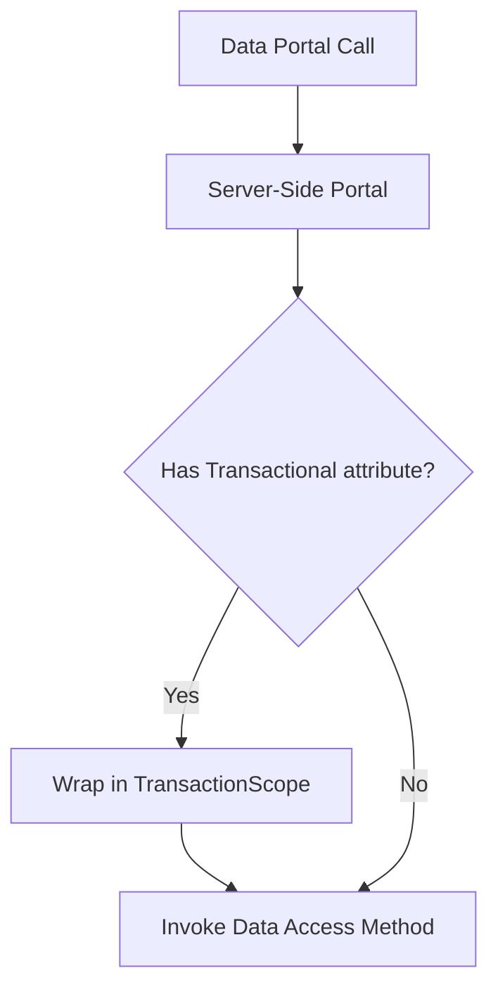

# In-Depth Guide to the CSLA .NET Data Portal

The CSLA .NET Data Portal is a powerful and foundational component that abstracts all data access into a consistent and configurable pattern. It enables the creation of a robust business layer that is independent of its physical deployment architecture. This guide provides an in-depth look at the concepts, components, and operations that make up the data portal.

## 1. What is the Data Portal?

At its core, the data portal is a software abstraction layer that provides a standard, centralized mechanism for all business object persistence operations: creating, retrieving, updating, and deleting (CRUD). It acts as a gateway between your business objects and your data access logic.

The primary benefits of using the data portal are:

*   **Architectural Abstraction:** It decouples your business and UI logic from the physical deployment model. You can switch between a simple 2-tier (client-to-database) architecture and a multi-tier (client-to-application-server-to-database) architecture by changing configuration settings, with no changes to your business logic code.
*   **Centralized Security:** It provides a single point of entry to the application server, allowing for centralized and consistent application of authentication and authorization rules for all data access.
*   **Consistent Persistence:** It establishes a uniform pattern for how all business objects are persisted, making the codebase easier to understand and maintain.
*   **Location Transparency:** Business objects are "mobile" and can move from a client to a server and back. The data portal handles this communication, making the physical location of the data access code transparent to the UI and business logic.

A simplified view of the data portal as a single entry point:



## 2. Key Components of the Data Portal

The data portal is not a single class, but a system of cooperating components that work together on both the client and the server.

### Client-Side Data Portal

This is the component your application code interacts with directly. It is exposed via the `IDataPortal<T>` interface, which you inject into your UI or factory classes.

Its primary responsibilities are:

*   Reading configuration settings to determine if the data access logic should be executed locally or on a remote server.
*   Loading the appropriate "client-side proxy" to handle the configured network transport protocol (e.g., HTTP).
*   Serializing the business object and other message data (like the user's identity) to be sent to the server.
*   Receiving the result from the server and deserializing it back into a business object.

Example of injecting and using the client-side data portal:

```csharp
public class CustomerViewModel
{
    private readonly IDataPortal<CustomerEdit> _customerPortal;

    public CustomerViewModel(IDataPortal<CustomerEdit> customerPortal)
    {
        _customerPortal = customerPortal;
    }

    public async Task FetchCustomer(int id)
    {
        var customer = await _customerPortal.FetchAsync(id);
        // ... use the customer object
    }
}
```

### Data Portal Proxies and Channels

A "data portal channel" is the combination of a client-side proxy and a server-side host that enables communication over a specific network protocol. CSLA abstracts the underlying transport mechanism, allowing you to choose the best fit for your application.

*   **`HttpProxy` (Default):** The built-in channel that communicates over standard HTTP/S. It is simple, firewall-friendly, and the most common choice.
*   **Custom Channels:** You can create your own channels to support other protocols like gRPC, RabbitMQ, or any other transport you need. This is an advanced extensibility point.

The client-side data portal selects the configured proxy, which then handles the details of communicating with its corresponding host on the server.

### Server-Side Host

The server-side host is the public endpoint on your application server that listens for incoming requests from a client-side proxy. For the default HTTP channel, the host is typically an ASP.NET Core MVC controller.

Example `DataPortalController` in an ASP.NET Core project:

```csharp
[Route("api/[controller]")]
[ApiController]
public class DataPortalController : Csla.Server.Hosts.HttpPortalController
{
    // The base controller handles POST requests and routes them
    // to the server-side data portal.
    public DataPortalController(ApplicationContext applicationContext)
        : base(applicationContext) { }
}
```

This controller acts as the public-facing gateway to the server-side data portal logic.

### Server-Side Data Portal

This component runs on the application server (or locally if so configured) and orchestrates the actual data access operation.

Its responsibilities include:

*   Receiving the request from the client.
*   Setting the server thread's context, including the user's identity (`ClaimsPrincipal`) and culture.
*   Wrapping the data access operation in a transaction if requested.
*   Routing the call to the appropriate method on either the business object itself or a dedicated "object factory."

The server-side data portal can manage transactions declaratively using the `[Transactional]` attribute on your data access methods:

```csharp
[Update]
[Transactional(TransactionalTypes.TransactionScope)]
private void Update([Inject] IMyDataAccess dal)
{
    // This code will run within a TransactionScope
    // to ensure atomicity.
    dal.UpdateData(this.FieldManager.GetChildren());
}
```

The transactional routing looks like this:



## 3. Data Portal Operations

The data portal standardizes on a set of five operations. You implement methods in your business object (or an object factory) decorated with attributes corresponding to these operations.

| Operation | Attribute | Purpose |
| :-------- | :-------- | :------ |
| **Create** | `[Create]` | Creates a new business object instance and initializes it with default values, which may come from the database. |
| **Fetch** | `[Fetch]` | Retrieves data for an existing business object from the database and loads it into the object. |
| **Update** | `[Insert]`, `[Update]`, `[DeleteSelf]` | Persists changes to an editable object. The data portal automatically calls the correct method based on the object's state (`IsNew`, `IsDirty`, `IsDeleted`). |
| **Delete** | `[Delete]` | Immediately deletes a business object's data from the database based on criteria. |
| **Execute** | `[Execute]` | Runs a command or process on the server. Used for operations that don't fit the standard CRUD model. |

### Example: The Fetch Operation

1.  **Client Code:** The client calls `FetchAsync`, passing criteria to identify the object.
    ```csharp
    var customer = await _customerPortal.FetchAsync(customerId);
    ```
2.  **Server-Side Implementation:** The data portal invokes the method marked with `[Fetch]` in your business class.
    ```csharp
    public class CustomerEdit : BusinessBase<CustomerEdit>    {
        // ... properties

        [Fetch]
        private void Fetch(int id, [Inject] ICustomerDal dal)
        {
            var data = dal.Fetch(id);
            using (BypassPropertyChecks)
            {
                // Load object properties from data
                this.Name = data.Name;
            }
        }
    }
    ```

## 4. The Object Factory Model

By default, the data portal calls methods directly on the business object (e.g., `[Fetch]` in `CustomerEdit`). As an alternative, you can tell the data portal to use a separate "factory" object to contain the data access logic.

There are four basic locations where you can implement data access code, summarized in the table below.

| Data portal invokes | Data access location | Pros | Cons |
| :-- | :-- | :-- | :-- |
| Business object methods | **Recommended technique**; In separate Data Access layer, typically loaded using a layer of indirection; Known as *Encapsulated Invocation* | Business object encapsulation is preserved, and provides clean separation between Business layer and Data Access layer | Requires careful design of Data Access layer interface to avoid coupling between business and Data Access layers |
| Business object methods | Directly in business object methods; Known as *Encapsulated Implementation* | Simplest model, and business object encapsulation is preserved | Lacks separation between Business layer and Data Access layer |
| Factory object methods | Directly in factory object methods; Known as *Factory Implementation* | Provides clean separation between Business layer and Data Access layer | Breaks business object encapsulation |
| Factory object methods | In separate Data Access layer, typically loaded using a layer of indirection; Known as *Factory Invocation* | Most complex model, breaks business object encapsulation, and involves an extra layer of indirection that is typically not needed |

This is done by decorating the business class with the `[ObjectFactory]` attribute:

```csharp
[ObjectFactory(typeof(CustomerFactory))]
public class CustomerEdit : BusinessBase<CustomerEdit>
{
    // ... properties ... NO data access methods here
}
```

You then create a factory class that contains the data access methods:

```csharp
public class CustomerFactory : ObjectFactory
{
    public CustomerEdit Fetch(int id, [Inject] ICustomerDal dal)
    {
        var customer = (CustomerEdit)ApplicationContext.CreateInstanceDI(typeof(CustomerEdit));
        var data = dal.Fetch(id);
        using (BypassPropertyChecks(customer))
        {
            customer.Name = data.Name;
        }
        MarkOld(customer);
        return customer;
    }
}
```

**Pros of the Factory Model:**

*   Achieves a very strong separation of concerns between business logic (in the business object) and data access logic (in the factory).

**Cons of the Factory Model:**

*   The factory needs to manipulate the internal state of the business object, which can feel like it breaks encapsulation (`BypassPropertyChecks`, `MarkOld`).
*   It introduces another class to maintain for each business object.

The **recommended approach** for most scenarios is the default "encapsulated invocation" model, where the data portal calls methods on the business object itself. This preserves encapsulation while still allowing for clean separation by having the business object method immediately delegate the call to a separate Data Access Layer (DAL) component, which is injected into the method.

## 5. Differentiating Root and Child Data Portal Operations

The data portal operations discussed so far (`[Create]`, `[Fetch]`, `[Update]`, etc.) are considered **root operations**. They are initiated by a consumer outside the business object graph, such as the UI layer, and they operate on a root business object (e.g., `EditableRoot`, `ReadOnlyList`).

However, once a root operation is executing on the logical server, the parent business object often needs to perform persistence operations on its child objects. These nested operations are handled by the **child data portal**.

The child data portal is invoked from within the data access methods of the *parent* object. It uses a different set of attributes to identify the methods on the child object that should be called.

### Child Operation Attributes

Here are the attributes for child data portal operations:

| Child Operation | Attribute | Purpose |
| :-------------- | :-------- | :------ |
| **Create Child** | `[CreateChild]` | Creates a new child object instance, typically called when the parent is being created. |
| **Fetch Child** | `[FetchChild]` | Retrieves data for a child object, typically called from the parent's `[Fetch]` method. |
| **Update Child** | `[InsertChild]`, `[UpdateChild]`, `[DeleteSelfChild]` | Persists changes to a child object. This is called from the parent's `[Update]` method. The data portal automatically calls the correct method on the child based on its state. |

### Typical Workflow: Root Operation Triggering Child Operations

Consider fetching a root `Order` object that contains a child collection of `LineItem` objects.

1.  **Client Invocation (Root):** The UI calls the root data portal to fetch the `Order`.
    ```csharp
    // In the UI or ViewModel
    var order = await dataPortal.FetchAsync<Order>(orderId);
    ```
2.  **Parent's Data Access (Root):** The data portal executes the `[Fetch]` method on the `Order` object. Inside this method, the parent fetches its own data and then uses the child data portal to fetch its children.
    ```csharp
    // Inside the Order class
    [Fetch]
    private void Fetch(int orderId, [Inject] IChildDataPortal<LineItems> childPortal)
    {
        // 1. Fetch parent's own data
        var orderData = dal.GetOrder(orderId);
        this.OrderDate = orderData.OrderDate;
        // ... load other parent properties

        // 2. Use the child data portal to fetch the child collection
        this.LineItems = childPortal.FetchChild(orderId);
    }
    ```
3.  **Child's Data Access (Child):** The `childPortal.FetchChild()` call executes the method marked with `[FetchChild]` on the `LineItems` child object.
    ```csharp
    // Inside the LineItems class (the child collection)
    [FetchChild]
    private void FetchChild(int orderId, [Inject] ILineItemDal dal, [Inject] IChildDataPortal<LineItem> itemPortal)
    {
        // Fetch the collection of line item data for the given orderId
        var itemsData = dal.GetLineItemsForOrder(orderId);
        foreach (var itemData in itemsData)
        {
            // Create and add child items to this collection
            var newItem = itemPortal.FetchChild(itemData);
            this.Add(newItem);
        }
    }
    ```

This clear distinction between root and child operations ensures that child objects cannot be directly accessed from the client, enforcing the parent-child relationship and the integrity of the object graph.

### Exception: Server-Side Root Operations

It is important to note that code executing on the logical server *can* still invoke the **root data portal**. This is a common and powerful pattern, often used within a command object to orchestrate operations on multiple, independent root objects within a single server-side transaction.

For example, a command object's `[Execute]` method might call `dataPortal.FetchAsync<Customer>(...)` and `dataPortal.FetchAsync<Product>(...)` to work with two different root objects before performing some combined action.

